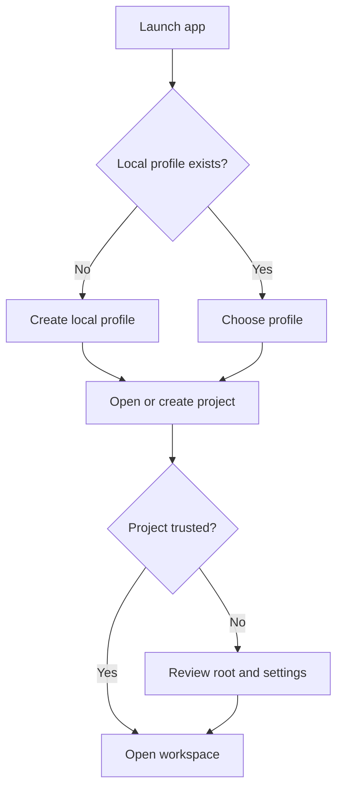
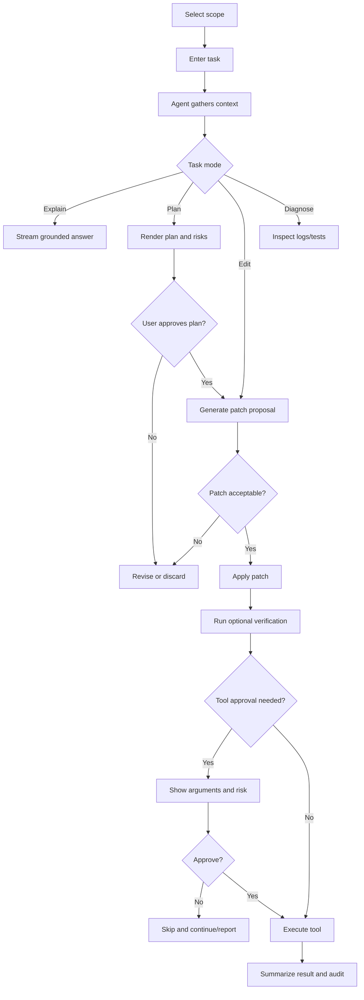
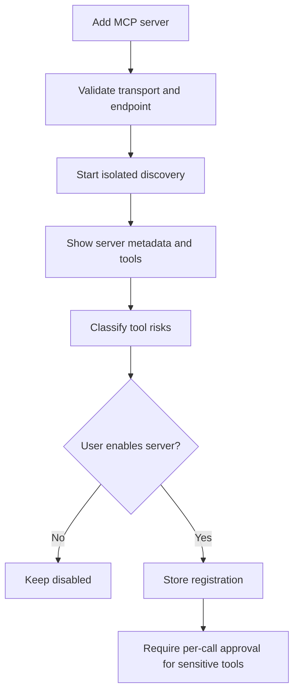
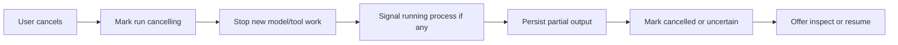

# User Flows

## First launch

```mermaid
flowchart TD
  A[Launch app] --> B{Local profile exists?}
  B -- No --> C[Create local profile]
  B -- Yes --> D[Choose profile]
  C --> E[Open or create project]
  D --> E
  E --> F{Project trusted?}
  F -- No --> G[Review root and settings]
  F -- Yes --> H[Open workspace]
  G --> H
```

## Agent coding loop

```mermaid
flowchart TD
  A[Select scope] --> B[Enter task]
  B --> C[Agent gathers context]
  C --> D{Task mode}
  D -- Explain --> E[Stream grounded answer]
  D -- Plan --> F[Render plan and risks]
  D -- Edit --> G[Generate patch proposal]
  D -- Diagnose --> H[Inspect logs/tests]
  F --> I{User approves plan?}
  I -- No --> J[Revise or discard]
  I -- Yes --> G
  G --> K{Patch acceptable?}
  K -- No --> J
  K -- Yes --> L[Apply patch]
  L --> M[Run optional verification]
  M --> N{Tool approval needed?}
  N -- Yes --> O[Show arguments and risk]
  O --> P{Approve?}
  P -- No --> Q[Skip and continue/report]
  P -- Yes --> R[Execute tool]
  N -- No --> R
  R --> S[Summarize result and audit]
```

## MCP registration

```mermaid
flowchart TD
  A[Add MCP server] --> B[Validate transport and endpoint]
  B --> C[Start isolated discovery]
  C --> D[Show server metadata and tools]
  D --> E[Classify tool risks]
  E --> F{User enables server?}
  F -- No --> G[Keep disabled]
  F -- Yes --> H[Store registration]
  H --> I[Require per-call approval for sensitive tools]
```

## Cancellation

```mermaid
flowchart LR
  A[User cancels] --> B[Mark run cancelling]
  B --> C[Stop new model/tool work]
  C --> D[Signal running process if any]
  D --> E[Persist partial output]
  E --> F[Mark cancelled or uncertain]
  F --> G[Offer inspect or resume]
```
